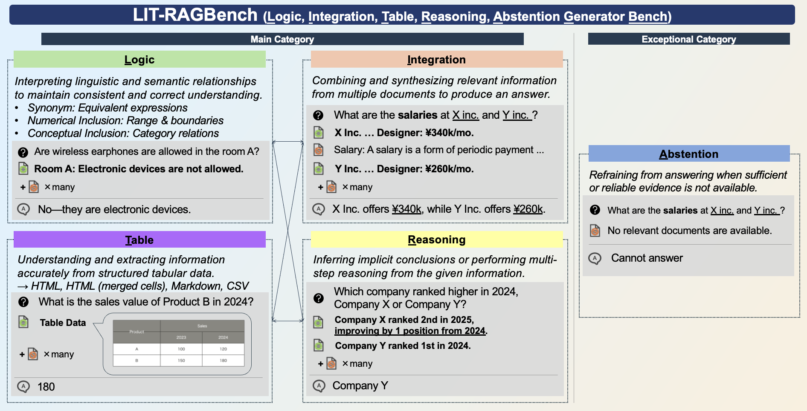

# LIT-RAGBench: Benchmarking Generator Capabilities of Large Language Models in Retrieval-Augmented Generation

## Overview
**LIT-RAGBench** is a benchmark for evaluating generator capabilities in Retrieval-Augmented Generation (RAG).
It focuses on whether a model can answer questions correctly given retrieved documents, independent of retrieval quality.
The benchmark covers five categories: **Integration, Reasoning, Logic, Table, and Abstention**.



The LIT-RAGBench dataset is also available on [Hugging Face](https://huggingface.co/datasets/neoai-inc/LIT-RAGBench).

```python
from datasets import load_dataset

dataset = load_dataset("neoai-inc/LIT-RAGBench")
```

## Repository Structure

### Datasets: `datasets/`

Each example includes the following fields:

- `question`
- `answer`: reference answer
- `qa_type`: question type
- `positive_chunk_list`: relevant evidence chunks
- `negative_chunk_list`: irrelevant chunks
- `reasoning_content`: reasoning process for deriving the answer


### Prompts:  `prompts/`

#### `prompts/evaluation/`

Prompts for evaluating LLM performance in this benchmark via LLM-as-a-Judge.

- **`generate_en.txt`** / **`generate_ja.txt`**: System prompts for instructing the evaluated LLM to generate answers based on retrieved documents

- **`judge_en.txt`** / **`judge_ja.txt`**: System prompts for the judge model to assess answer correctness

### Code: `src/`

Example code for running the benchmark evaluation:

Set the `OPENAI_API_KEY` environment variable or create a `.env` file with your API key.

```bash
uv sync
uv run python src/run.py --lang en
```

## Reference

```bibtex
@misc{litragbench,
      title={LIT-RAGBench: Benchmarking Generator Capabilities of Large Language Models in Retrieval-Augmented Generation},
      author={Koki Itai and Shunichi Hasegawa and Yuta Yamamoto and Gouki Minegishi and Masaki Otsuki},
      year={2026},
      eprint={2603.06198},
      archivePrefix={arXiv},
      primaryClass={cs.CL},
      url={https://arxiv.org/abs/2603.06198},
}
```


## License

The code and data are released under the Creative Commons Attribution-NonCommercial-ShareAlike 4.0 International Public License for Noncommercial use only. Any commercial use should get formal permission first.

Shield: [![CC BY-NC-SA 4.0][cc-by-nc-sa-shield]][cc-by-nc-sa]

This work is licensed under a
[Creative Commons Attribution-NonCommercial-ShareAlike 4.0 International License][cc-by-nc-sa].

[![CC BY-NC-SA 4.0][cc-by-nc-sa-image]][cc-by-nc-sa]

[cc-by-nc-sa]: http://creativecommons.org/licenses/by-nc-sa/4.0/
[cc-by-nc-sa-image]: https://licensebuttons.net/l/by-nc-sa/4.0/88x31.png
[cc-by-nc-sa-shield]: https://img.shields.io/badge/License-CC%20BY--NC--SA%204.0-lightgrey.svg